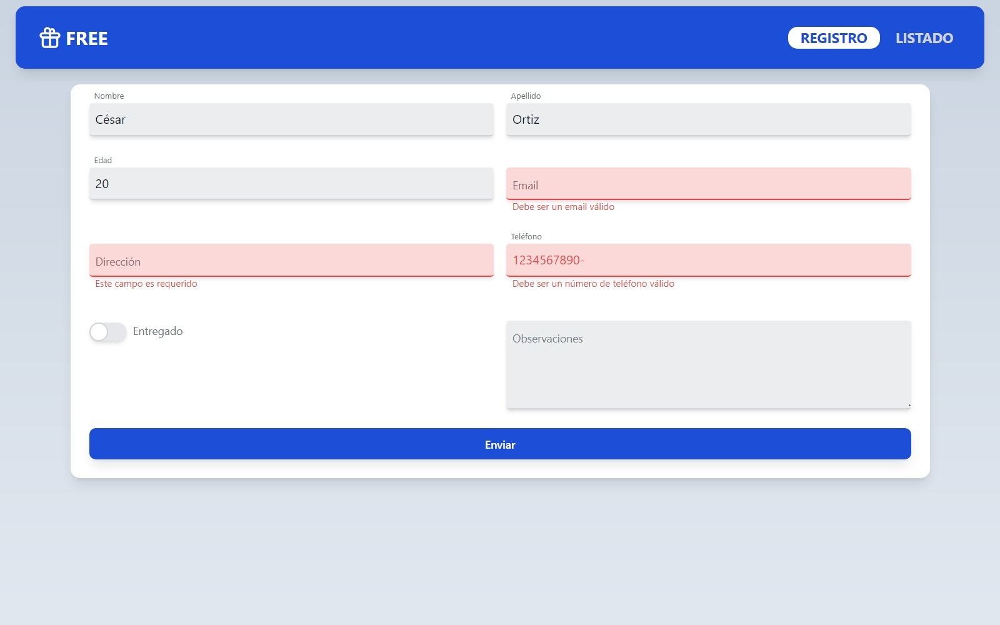
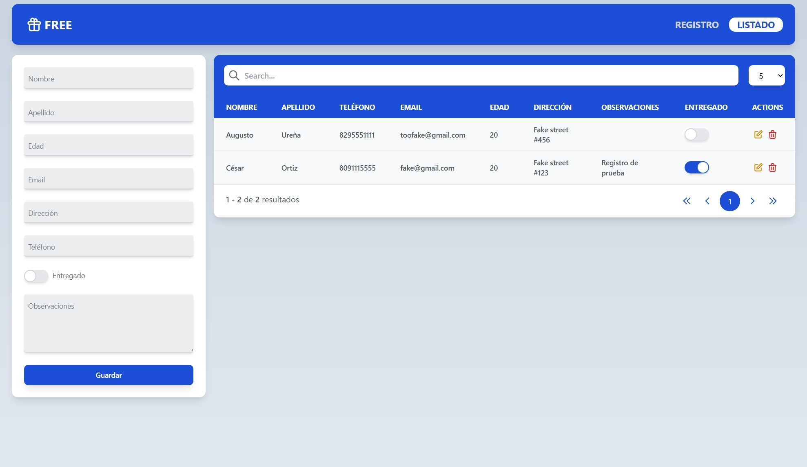

# Jornada de almuerzo ¡gratis!

La aplicación permite al usiario guardar, editar, leer o eliminar los registros desde las vistas de registro y listado.

## Librerías usadas

[React](https://es.reactjs.org/):
Framework front end utilizado

[Tailwindcss](https://tailwindcss.com/):
framework de estilos css basado en clases.

[React Router](https://reactrouter.com/):
Libreria utilizada para el routing de las vistas.

[React Hook Form](https://react-hook-form.com/):
Libreria de hooks utilizados para la validación de formularios.

[SweetAlert2](https://sweetalert2.github.io/):
Libreria utilizada para la creación de alertas de confirmación y notificación.

## Ejecución de la aplicación

Para ejecutar esta aplicación vas a necesitar [Git](https://git-scm.com) y [Node.js](https://nodejs.org/en/download/) instalados.

```bash
# Clonar el repositorio
$ git clone https://github.com/CesarAOrtiz/formulario-registro-comidas

# Instalar las dependencias
$ npm install

# Ejecutar la aplicación
$ npm start
```

## Funcionamiento de la aplicación

[Página de Registro](https://formulario-registro-comidas-e6pmcswm4-cesaraortiz.vercel.app/registro)



En esta pantalla se encuentra el formulario de creación de registros. Los campos se validan mientras el usuario escribe, muestran un texto describiendo el tipo de error y no permite enviar el formulario hasta que los campos estén debidamente completados.

Al enviar el formulario este simula un pequeño tiempo de espera para mostrar que el botón de envío se desaculita para evitar el envío de otro formulario hasta que se obtenga la respuesta.

Al realizarce la operación se muestra una alerta notificando el resultado. Casa 3 envíos el tercero simula un error.

En caso de éxito el registro se almacena en el local storage y estará disponible en la página se listado.

[Página de Listado](https://formulario-registro-comidas-e6pmcswm4-cesaraortiz.vercel.app/listado)



Aquí se muestra una lista con los registros que se han agregado, cada fila tiene un botón para actualizar el estado de la entrega y al precinarlo muestra una notificación de la acción.

La tabla cuenta con una barra de búsqueda para filtrar por nombre o correo, y una sección de paginación para navegar por ella. También tiene una columna de acciones con botones de editar y eliminar. Está columna es sticky por lo que está siempre visible para facilitar su acceso a los usuarios.

Al presionar el botón de eliminar aparece una alerta de confirmación de la acción y en caso de permitirse la acción una notificación del resultado.

Botón de editra llena el formulario con los datos del registro seleccionado. El cuál es editado al enviar el formulario y este cambio se refleja en la tabla.

Este formulario al igual que el de creación simula un tiempo de carga y caso de error.
